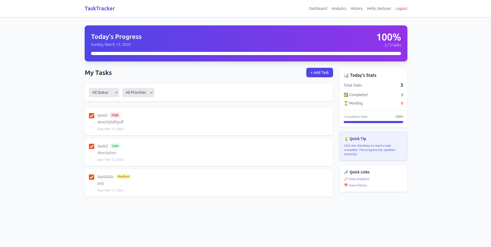
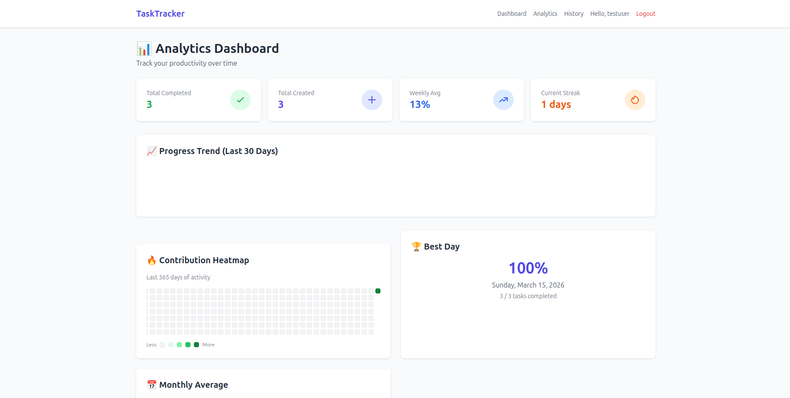
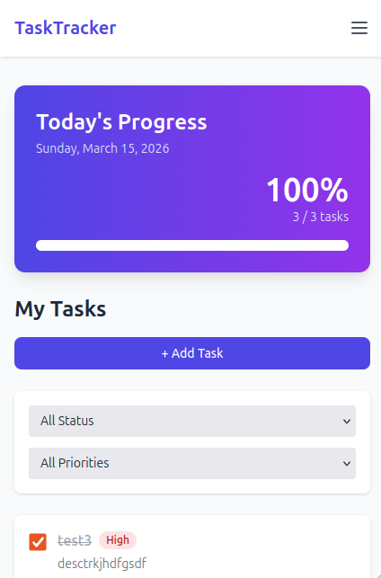
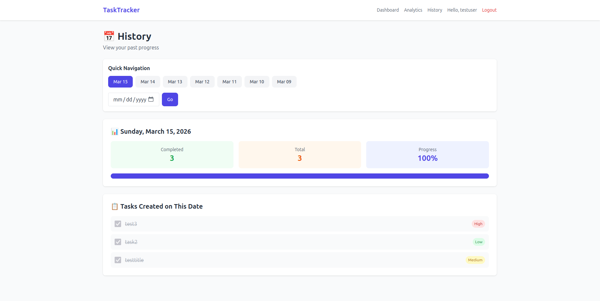

# 📋 Django To-Do Progress Tracker

A **modern productivity tracker** built with **Django, HTMX, TailwindCSS, and Chart.js**.
The application helps users manage tasks, visualize productivity, and track daily progress through charts and a GitHub-style contribution heatmap.

This project is designed as a **portfolio-ready full-stack Django application** demonstrating backend architecture, UI design, and productivity analytics.

---

# 🚀 Live Features

## 🎯 Task Management

* Create, update, and delete tasks
* Mark tasks as completed instantly
* Task priorities (Low / Medium / High)
* Due date tracking
* User-specific task lists
* Task filtering (completed / pending)

---

## 📊 Productivity Tracking

* Real-time progress bar
* Daily productivity statistics
* Completed vs pending tasks overview
* Automatic completion percentage calculation

```
progress = completed_tasks / total_tasks * 100
```

---

## 📈 Analytics Dashboard

Includes a full analytics system:

* 📅 **30-Day productivity chart**
* 🔥 **GitHub-style activity heatmap**
* 📉 **Productivity trend visualization**
* 📆 Daily progress history
* 🏆 Best productivity day
* ⚡ Current productivity streak

Charts are powered by **Chart.js**.

---

## ⚡ Real-Time UI (HTMX)

The application uses **HTMX** to avoid full page reloads.

Example:

```
<input type="checkbox"
hx-post="/tasks/5/toggle/"
hx-trigger="change"
hx-target="#task-list"
>
```

This allows:

* instant task completion
* automatic progress update
* smooth UI experience

No heavy frontend frameworks required.

---

# 🛠 Tech Stack

| Layer          | Technology          |
| -------------- | ------------------- |
| Backend        | Django              |
| Language       | Python              |
| Database       | SQLite / PostgreSQL |
| Frontend       | Django Templates    |
| Styling        | TailwindCSS         |
| Interactivity  | HTMX                |
| Charts         | Chart.js            |
| Authentication | Django Auth System  |

---

# 📁 Project Architecture

```
todo_tracker
│
├── accounts
│   ├── models.py
│   ├── views.py
│   ├── forms.py
│   └── urls.py
│
├── tasks
│   ├── models.py
│   ├── views.py
│   ├── forms.py
│   ├── signals.py
│   └── urls.py
│
├── analytics
│   ├── models.py
│   ├── views.py
│   ├── utils.py
│   └── urls.py
│
├── core
│   └── views.py
│
├── templates
│   ├── base.html
│   ├── tasks
│   ├── accounts
│   └── analytics
│
├── static
│
├── manage.py
└── requirements.txt
```

This structure separates the project into clear domains:

* **accounts** → authentication
* **tasks** → task management
* **analytics** → productivity tracking
* **core** → shared logic

## 🌐 Live Demo

### ✨ Try it now: [https://todo-tracker-w2xw.onrender.com/dashboard/](https://todo-tracker-w2xw.onrender.com/dashboard/)

> ⚠️ **Note**: Free Render instances spin down after 15 minutes of inactivity. The first load may take ~30 seconds to wake up.

### 🔑 Demo Credentials
| Username | Password | Access |
|----------|----------|--------|
| `admin` | `admin123` | Admin panel access |

---

# 📸 Screenshots


## 📊 Dashboard

<p align="center">
  
</p>


## 📈 Analytics

<p align="center">
  
</p>


## 📱 Mobile View

<p align="center">
  
</p>


## 📅 History

<p align="center">
  
</p>

---

# ⚙️ Installation

## 1️⃣ Clone Repository

```
git clone https://github.com/bmuhammadam1n/todo-tracker.git
cd todo-tracker
```

---

## 2️⃣ Create Virtual Environment

Linux / Mac:

```
python3 -m venv venv
source venv/bin/activate
```

Windows:

```
python -m venv venv
venv\Scripts\activate
```

---

## 3️⃣ Install Dependencies

```
pip install -r requirements.txt
```

---

## 4️⃣ Apply Migrations

```
python manage.py migrate
```

---

## 5️⃣ Create Admin User

```
python manage.py createsuperuser
```

---

## 6️⃣ Run Development Server

```
python manage.py runserver
```

Open in browser:

```
http://127.0.0.1:8000
```

---

# 🔒 Security Features

The application includes several built-in security mechanisms:

* CSRF protection
* Django password hashing
* user-level data isolation
* login-required routes
* template auto-escaping
* secure session authentication

---

# 🧠 Key Learning Concepts

This project demonstrates knowledge of:

* Django project architecture
* backend-driven UI
* HTMX real-time interaction
* database modeling
* productivity analytics
* full-stack web development


---

# 🔮 Future Improvements

Planned features:

* dark mode
* task tags and categories
* recurring tasks
* email reminders
* calendar view
* REST API
* mobile application
* team collaboration

---


# 📜 License

MIT License

This project is open source and free to use for educational and commercial purposes.

---

# ⭐ Support

If you like this project:

⭐ Star the repository
🍴 Fork it
🧠 Use it to learn Django

---

<div align="center">

Built with ❤️ using Django

</div>
